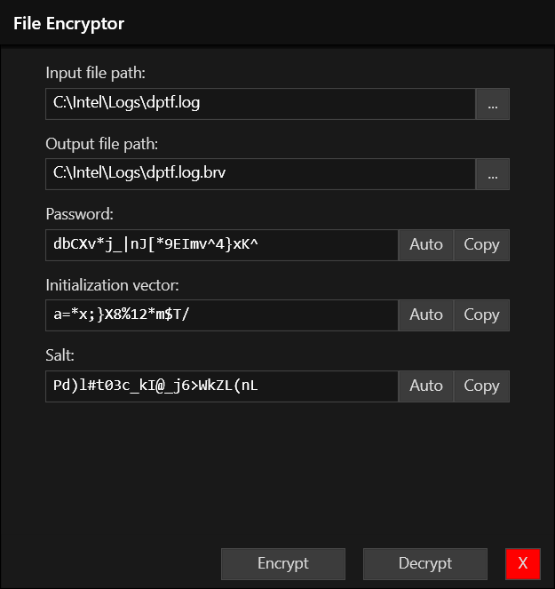

# File Encryptor / Decryptor

A WPF/C# and .NET Core 3.1 desktop app for encrypting and decrypting files on Windows 10. An accompanying .NET Core command-line interface tool enables encryption/decryption to be run from a terminal on any operating system.

This app has been neither vetted nor tested for security and is intended for research and development purposes only. Please do not use for production security work.

## License
The repository utilizes code licensed under the terms of the Apache Software License and therefore is licensed under ASL v2 or later.

This source code in this repository is free: you can redistribute it and/or modify it under the terms of the Apache Software License version 2, or (at your option) any later version.

This source code in this repository is distributed in the hope that it will be useful, but WITHOUT ANY WARRANTY; without even the implied warranty of MERCHANTABILITY or FITNESS FOR A PARTICULAR PURPOSE. See the Apache Software License for more details.

You should have received a copy of the Apache Software License along with this program. If not, see https://www.apache.org/licenses/LICENSE-2.0.html.

The source code forked from other open source projects will inherit its license.